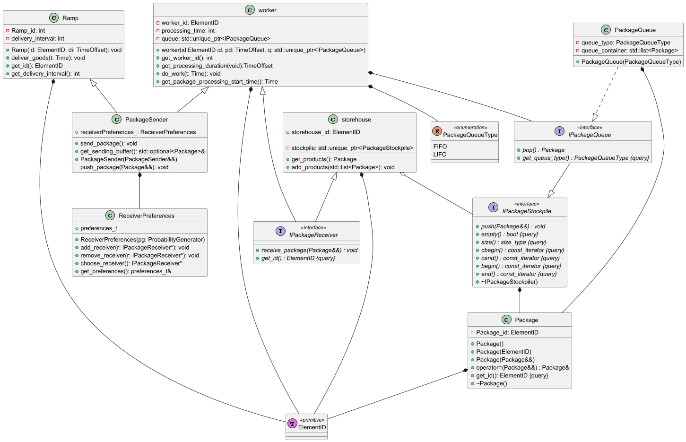

# NetSim – Symulacja sieci (C++)

Projekt służy do modelowania i symulacji przepływu produktów w sieci linii produkcyjnej fabryki. System pozwala na analizę wydajności i weryfikację spójności struktury logistycznej.

## Stos Technologiczny:
  * Język: C++ (Standard 14/17).
  * System budowania: CMake.
  * Testy jednostkowe: GoogleTest.

## Schemat Architektury:
Wizualizacja struktury klas i powiązań w systemie:

## Model Sieci:
Linia produkcyjna składa się z następujących węzłów (nodes):
  * Rampy rozładunkowe (Sources): dostarczają półprodukty do fabryki.
  * Robotnicy (Workers): przetwarzają półprodukty przy użyciu kolejek FIFO lub LIFO.
  * Magazyny (Sinks): przechowują gotowe produkty końcowe.
  
  ### Dopuszczalne połączenia:
    - Rampa → Robotnik
    - Robotnik → Robotnik
    - Robotnik → Magazyn

## Logika Symulacji:
Symulacja odbywa się w turach, a każda z nich składa się z następujących etapów:
1. *Dostawa: produkty pojawiają się na rampach.
2. *Przekazanie: natychmiastowe przesłanie produktu do odbiorcy.
3. *Przetworzenie: robotnicy pracują nad produktami przez określoną liczbę tur.
4. *Raportowanie: generowanie stanu symulacji w zadanych odstępach czasu.

## Konfiguracja:
System wczytuje strukturę sieci z plików tekstowych. Format wejściowy obejmuje:
  * Definicje ramp, robotników i magazynów.
  * Mapę połączeń między węzłami.

## Autorzy :
  * Mateusz Karpiak
  * Emilian Kaczyński
  * Karol Ji

## Licencja :
Projekt został udostępniony na licencji MIT
