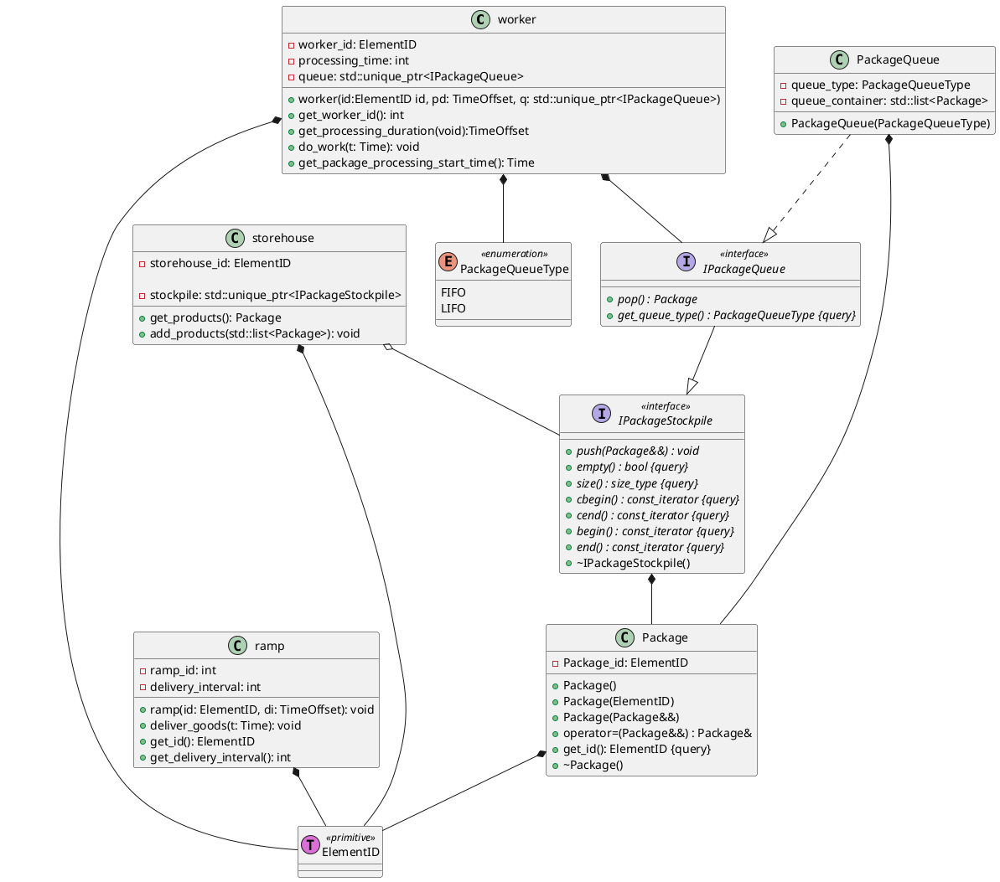

```plantuml
@startuml
class worker
{
+worker(id:ElementID id, pd: TimeOffset, q: std::unique_ptr<IPackageQueue>)
+get_worker_id(): int
+get_processing_duration(void):TimeOffset
+do_work(t: Time): void
+get_package_processing_start_time(): Time
-worker_id: ElementID
-processing_time: int
-queue: std::unique_ptr<IPackageQueue>
}
class ramp{
+ramp(id: ElementID, di: TimeOffset): void
+deliver_goods(t: Time): void
+get_id(): ElementID
+get_delivery_interval(): int
-ramp_id: int
-delivery_interval: int
}
class storehouse{
-storehouse_id: ElementID

+get_products(): Package
-stockpile: std::unique_ptr<IPackageStockpile>
+add_products(std::list<Package>): void
}


    interface IPackageStockpile <<interface>> {
	    + {abstract} push(Package&&) : void
	    + {abstract} empty() : bool {query}
	    + {abstract} size() : size_type {query}
	    + {abstract} cbegin() : const_iterator {query}
        + {abstract} cend() : const_iterator {query}
        + {abstract} begin() : const_iterator {query}
        + {abstract} end() : const_iterator {query}
	    + ~IPackageStockpile()
	}

	interface IPackageQueue <<interface>> {
	    + {abstract} pop() : Package
	    + {abstract} get_queue_type() : PackageQueueType {query}
	}
	

	enum PackageQueueType <<enumeration>> {
		FIFO
		LIFO
	}
	

	class PackageQueue {
	    - queue_type: PackageQueueType
	    - queue_container: std::list<Package> 
	    + PackageQueue(PackageQueueType)
	    
	}
	

	class Package {
		+ Package()
		+ Package(ElementID)
		+ Package(Package&&)
		+ operator=(Package&&) : Package&
		+ get_id(): ElementID {query}
		+ ~Package()
		-Package_id: ElementID
	}

worker *-- PackageQueueType
worker *-- IPackageQueue
IPackageStockpile *-- Package
PackageQueue ..|> IPackageQueue
worker *-- ElementID
IPackageQueue --|> IPackageStockpile
storehouse *-- ElementID
Package *-- ElementID
PackageQueue *-- Package
ramp *-- ElementID
storehouse o-- IPackageStockpile
	class ElementID << (T,orchid) primitive>>


@enduml
```
